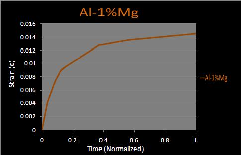
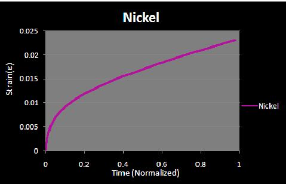

Creep is progressive i.e. permanent and time dependant deformation of a material at a constant stress below the yield strength of the material. Creep is seen in all types of materials and is observed to be severe in materials that are utilized in applications involving high operating temperatures for long periods of time. The deformation caused by creep need not always be catastrophic i.e. if a component is deformed by creep beyond the tolerable limits of the application, the application as a whole may fail even though the component has not actually fractured. Also it is not always an undesirable property, e.g. concrete has inbuilt tensile stresses which may lead to its fracture however, due to some moderate creep these stresses get relieved and the structure is saved. It is important to note that the words "permanent" and "time dependant" are very important since the deformation is not an elastic one nor is it a brittle one.The strain keeps on building over a period of time. Creep though dependant on various factors is generally observed to increase with rise in temperature.It is particularly important for metals whose operating temperature is greater than 0.4Tm and even amorphous polymers are sensitive to creep   <a href="https://youtu.be/EazzyT0qU44" target=_blank>NPTEL Lecture link</a>

 
<video width="500" height="240" controls>
  <source src="images/cmf.mp4" type="video/mp4">
  Your browser does not support the video tag</video>
 
  

Different materials have different properties and hence creep varies from material to material. It occurs for tungsten, which has a very high melting point, at very high temperatures (1370 C) while for solder, lead etc. which have very low melting points it occurs at room temperature. Also the since the creep curve depends on various factors like obstacle density, strength etc. it varies widely for different types of materials like ceramics, polymers and metals. Higher the strength of a material more is the resistance it offers to creep deformation. For brittle materials which generally do not show a plastic region the creep deformation behavior will be much different from ductile materials. You may check out the links provided in the right column for a comparison of creep behavior in different type of metals  

<b>Results</b>  
 
Platinum  
 
Aluminum-Magnesium  
 
Nickel  
<b>Conclusions</b>  
 
